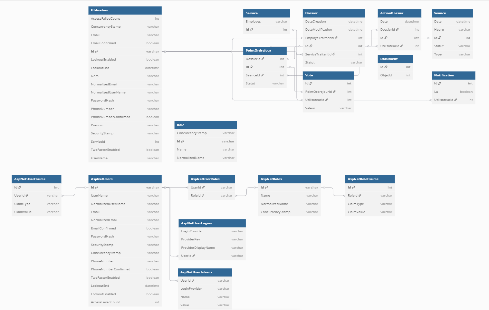

# Workflow Administratif

Application ASP.NET Core MVC permettant la gestion numérique de dossiers administratifs et de décisions politiques, dans le cadre d'une administration publique comme celle de la Province de Luxembourg.

---

## Objectif du projet

Ce projet a été réalisé dans le cadre d’un projet d’analyse et de conception d’application. Il vise à reproduire le fonctionnement d’une administration comprenant deux organes distincts :

- **Organe administratif** : gère les dossiers internes (RH, achats, environnement, etc.)
- **Organe politique** : Collège et Conseil provincial, délibérant et votant les décisions majeures

Chaque dossier suit un cycle de vie avec des statuts précis (créé, en attente, en traitement, etc.).

---

## Gestion des utilisateurs et des rôles

L'application utilise **ASP.NET Identity** avec gestion fine par **permissions** (claims) :

- Les utilisateurs sont liés à un service administratif
- Chaque utilisateur peut avoir un ou plusieurs rôles
- Les **permissions** sont affectées aux rôles, et contrôlées par **policy**
- Exemples :
  - `Permissions.Dossier.Acces` : accès aux dossiers
  - `Permissions.POJ.Creer` : création de points à l’ordre du jour
  - `Permissions.Seance.Modifier` : édition de séances

### Interface d’administration
Une interface permet :
- de créer/modifier les rôles
- d’attribuer dynamiquement les permissions via cases à cocher
- de gérer les utilisateurs et leurs rôles

---

## Fonctionnalités principales

- Authentification et autorisation sécurisée
- Création, transfert, édition, archivage de dossiers
- Ajout de documents liés à un dossier ou un points à l'ordre du jour
- Création de séances (Collège, Conseil)
- Vote des membres du Conseil sur les points à l'ordre du jour
- Système de notification et historique des actions
- Tableau de bord personnalisé par utilisateur
- Interface intuitive avec modales Bootstrap

---

## Architecture du code

| Dossier                  | Rôle                                               |
|--------------------------|----------------------------------------------------|
| `Workflow.Domain`        | Entités métier, enums, interfaces, permissions     |
| `Workflow.Application`   | Services applicatifs (logique métier)              |
| `Workflow.Persistence`   | Accès aux données via Entity Framework Core        |
| `Workflow.UI`            | ASP.NET MVC, contrôleurs, vues, layout, Identity

## Base de données

- Utilise **Entity Framework Core** avec **SQLite**
- Utilise des `DbSet<>` pour chaque entité : `Dossier`, `Seance`, `PointOrdreJour`, `Document`, `Vote`, etc.
- Gestion des permissions via `AspNetRoleClaims` et `IdentityRole`

